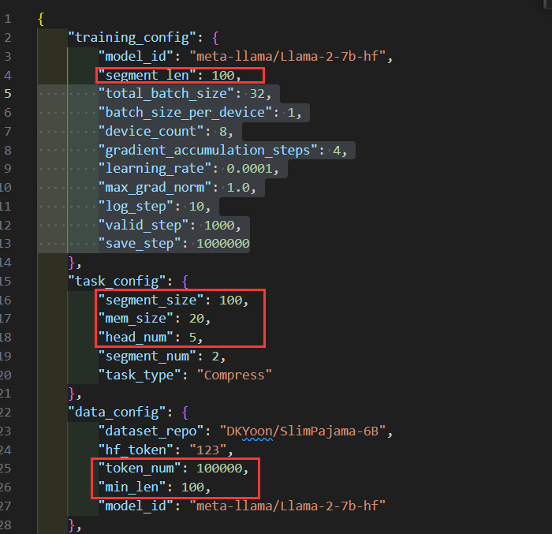

# mlllm
 Enhance LLM memory with self-supervised objectives for in-memory learning.


## 环境配置
```
git clone https://github.com/1azybug/mlllm.git
cd mlllm
conda create -n forget python=3.10 -y
conda activate forget
conda install pytorch==2.2.0 pytorch-cuda=12.1 -c pytorch -c nvidia
pip install -r requirements.txt -i https://pypi.tuna.tsinghua.edu.cn/simple

# numpy2似乎影响nltk的import(nltk->scipy->numpy)
pip install numpy<2
```

## 训练

```
cd compress
bash train.sh
```

## 评估
```
cd compress
python ./evaluator.py --work_dir CompressLLM --batch_size 1
```

会输出验证集三个loss和AE的BLEU-4。

## 超参数更改
修改 ./compress/CompressLLM/config.json


注意修改自己的hugging face的token访问令牌
segment_len和segment_size和min_len要保持一致

## Tips
处理数据的过程会比较慢，可以一边训练一边处理下一次训练用到的数据：
```
cd compress
python prepare_data.py --work_dir compressLLM_len-500_ratio_5
```

处理完后
```
CUDA_VISIBLE_DEVICES=0,1,2,3,4,5,6,7 python ./trainer.py --work_dir compressLLM_len-500_ratio_5 --port 12314
```


## 消融实验
```
在config文件的"task_config"中加入键值"addition": "without_compress_loss"
CUDA_VISIBLE_DEVICES=0,1 python ./trainer.py --work_dir debug_CompressLLM_wo-cmp --port 12314
CUDA_VISIBLE_DEVICES=0,1 python ./evaluator.py --work_dir debug_CompressLLM_wo-cmp --batch_size 1
```

## 指令微调
将config.josn的data_config中加入"instruction_dataset_repo": "sggetao/PwC"

```
# 数据预处理
python instruction_prepare_data.py --work_dir debug_CompressLLM_wo-cmp
# 训练(确保已经经过AE和LM训练)
CUDA_VISIBLE_DEVICES=0,1 python ./instruction_trainer.py --work_dir debug_CompressLLM_wo-cmp --port 12314
# 评估
CUDA_VISIBLE_DEVICES=0,1 python ./instruction_evaluator.py --work_dir debug_CompressLLM_wo-cmp --batch_size 1
```


## 消融实验+指令微调实验

压缩率 15x的消融实验(没有compress loss)
```
python ./trainer.py --work_dir compressLLM_len-510-ratio-15_wo-cmp --port 29500
python ./evaluator.py --work_dir compressLLM_len-510-ratio-15_wo-cmp --batch_size 1
```

压缩率 15x的指令微调实验
```
# 数据预处理
python instruction_prepare_data.py --work_dir compressLLM_len-510_ratio-15
# 训练(确保已经经过AE和LM训练)
python ./instruction_trainer.py --work_dir compressLLM_len-510_ratio-15 --port 29500
# 评估
python ./instruction_evaluator.py --work_dir compressLLM_len-510_ratio-15 --batch_size 1
```


压缩率 15x的指令微调消融实验(没有compress loss)
```
# 数据预处理
python instruction_prepare_data.py --work_dir compressLLM_len-510-ratio-15_wo-cmp
# 训练(确保已经经过AE和LM训练)
python ./instruction_trainer.py --work_dir compressLLM_len-510-ratio-15_wo-cmp --port 29500
# 评估
python ./instruction_evaluator.py --work_dir compressLLM_len-510-ratio-15_wo-cmp --batch_size 1
```